# TUF-ROG-Power-Plan-missing

If your power plan or **Power mode synchronization** option in Armoury Crate is missing on your TUF or ROG laptop, this repository provides solutions to bring them back.

---

## Overview

### How it normally looks
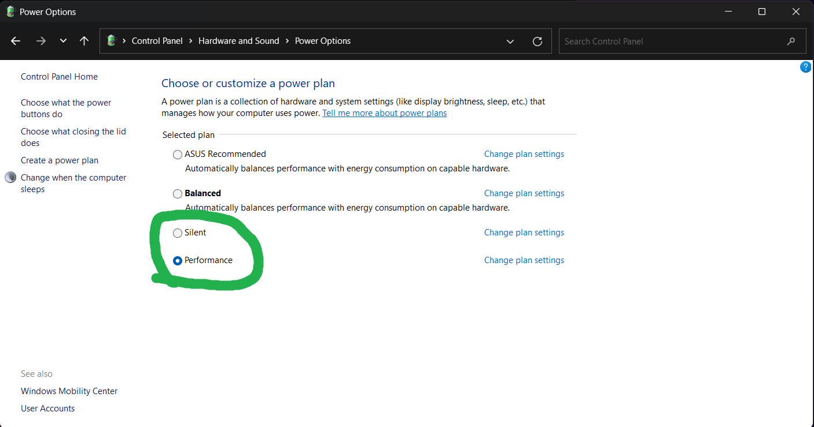

### Expected options in Armoury Crate


---

## How to Fix It

There are two main methods depending on your system state.

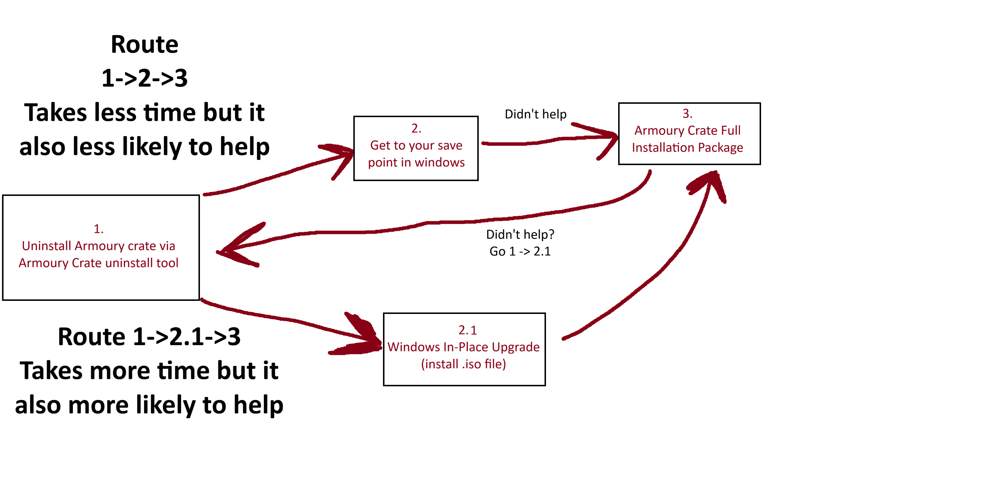

---

## Steps

### Step 1: Uninstall Armoury Crate

1. Download the [Armoury Crate Uninstall Tool](https://www.asus.com/supportonly/armoury%20crate/helpdesk_download/).
2. Click **Show all** and scroll down until you locate the tool.

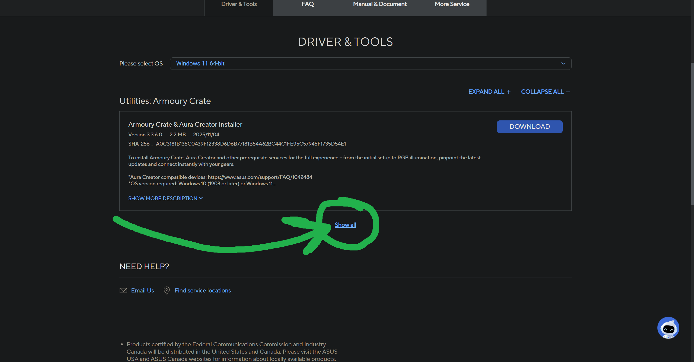

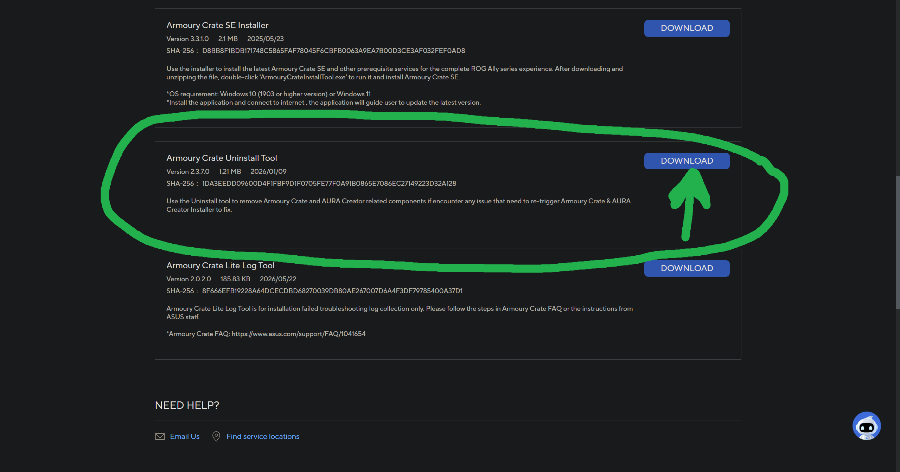

3. Unzip the downloaded archive to your Desktop.
4. Run `Armoury Crate Uninstall Tool.exe` as **Administrator**.


5. Wait for the uninstallation process to finish, then **restart your PC**.

---

### Step 2: System Restore

1. Press `Win + R`, type `rstrui.exe`, and click **OK**.

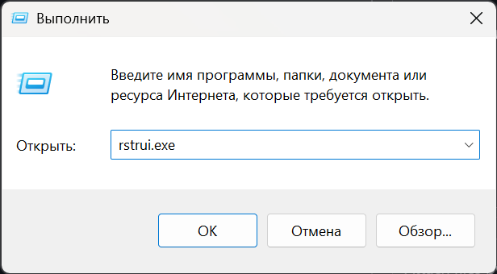

2. Click **Next**.

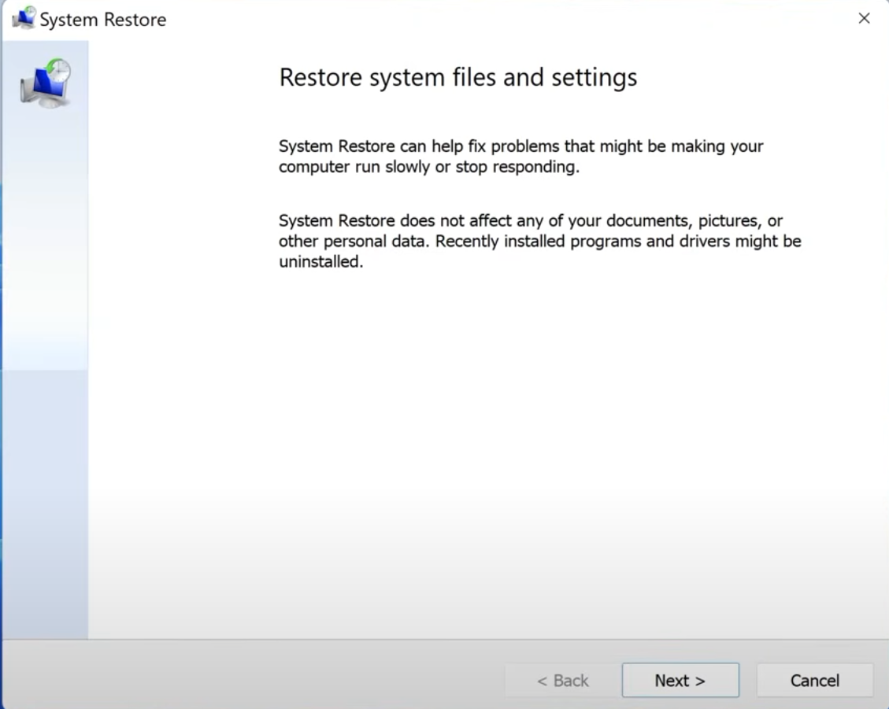

3. Review the available restore points and select one created **before** the issue occurred.
   
> [!NOTE]
> If you don't have any restore points available, or if they are all too recent, **skip to Step 2.1**.

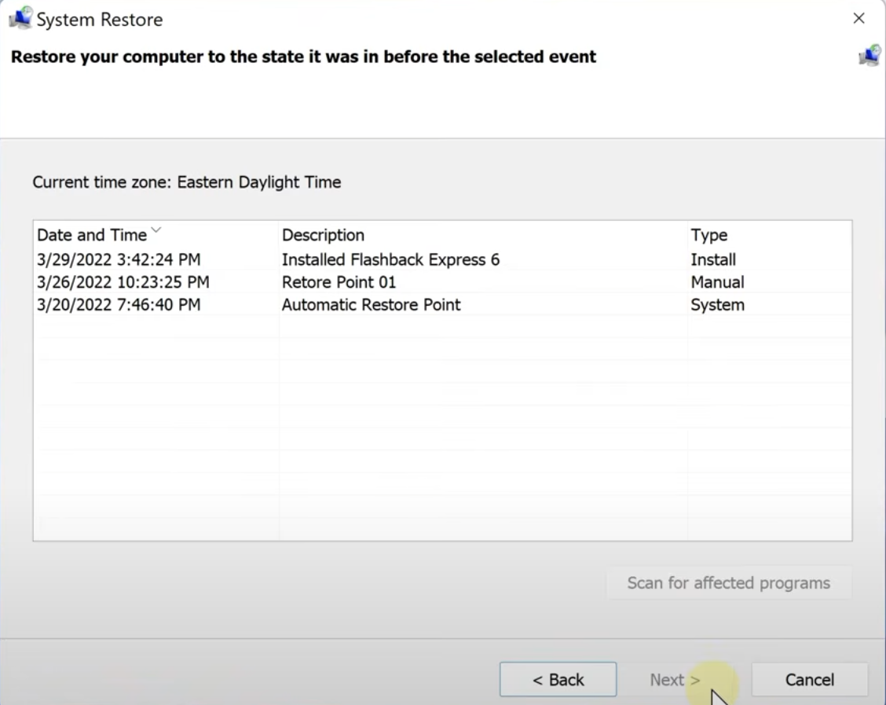

4. Click **Finish** to start the restore process.

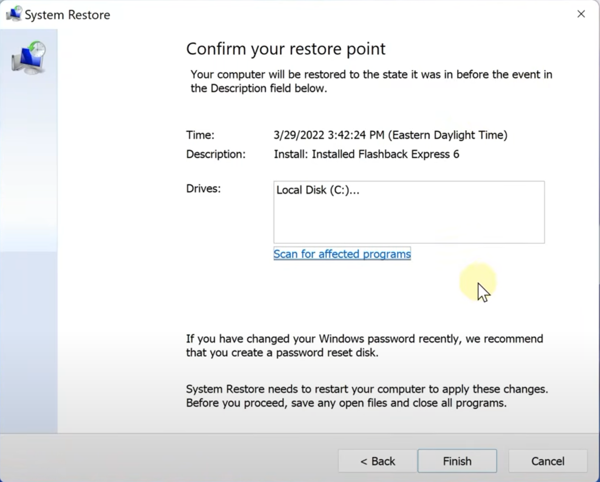

### Step 2.1: Windows In-place Upgrade <br>(If step 2 -> 3 didn't help, IF YOU DOING STEP 2 RIGHT NOW - SKIP TO STEP 3)

Save your wallpaper because they will dissapear
1. Run powershell (Press Win and type "Windows Powershell and run it)
   
2. Copy and paste command below

```bash
explorer.exe /select,(Get-ItemProperty "HKCU:\Control Panel\Desktop").Wallpaper
```

3. Save it somewhere for later
   
4. Download Win11 iso file with your language
**Link: https://www.microsoft.com/en-us/software-download/windows11**

5. Scroll to "Download Windows 11 Disk Image (ISO) for x64 devices" <br> Select it and confirm

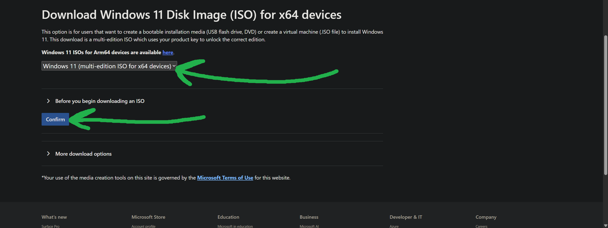

7. Select the language you want your **system** be in and confirm

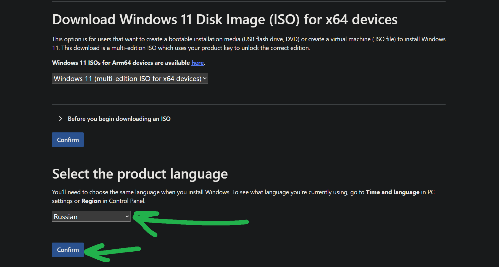

9. You will see download button. Click it

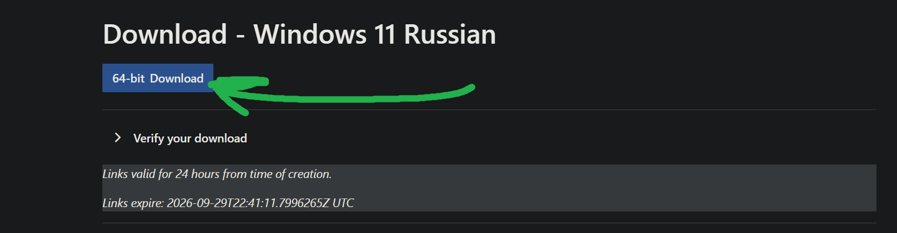

10. After you downloaded it, right click file and click **"connect"**

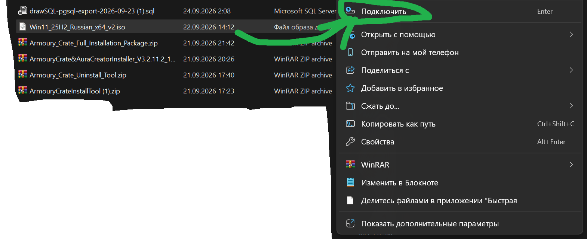

11. You will see new drive in explorer. Double click it.
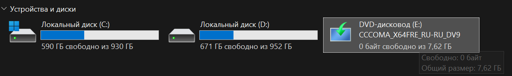

> [!NOTE]
> If you want to cancel it - right click new drive and click *Eject* **SKIP THIS STEP IF YOU DONT WANT TO CANCEL IT**

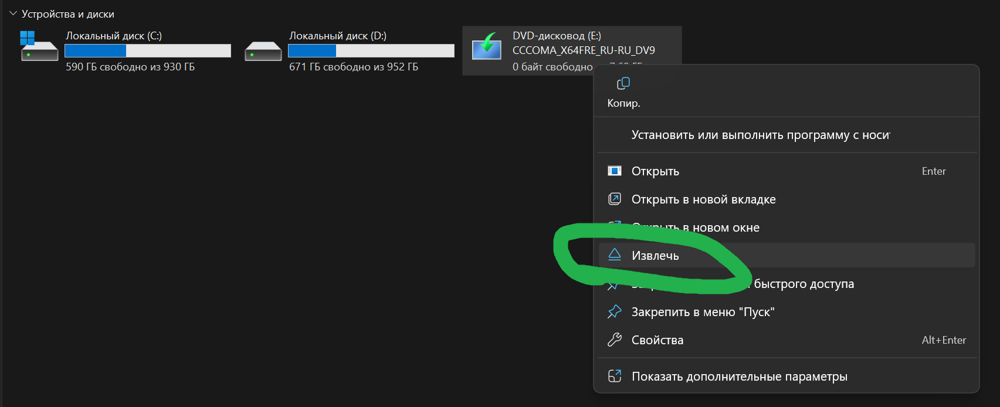

12. You will see windows window XD <br> Click next. It will check for updates.

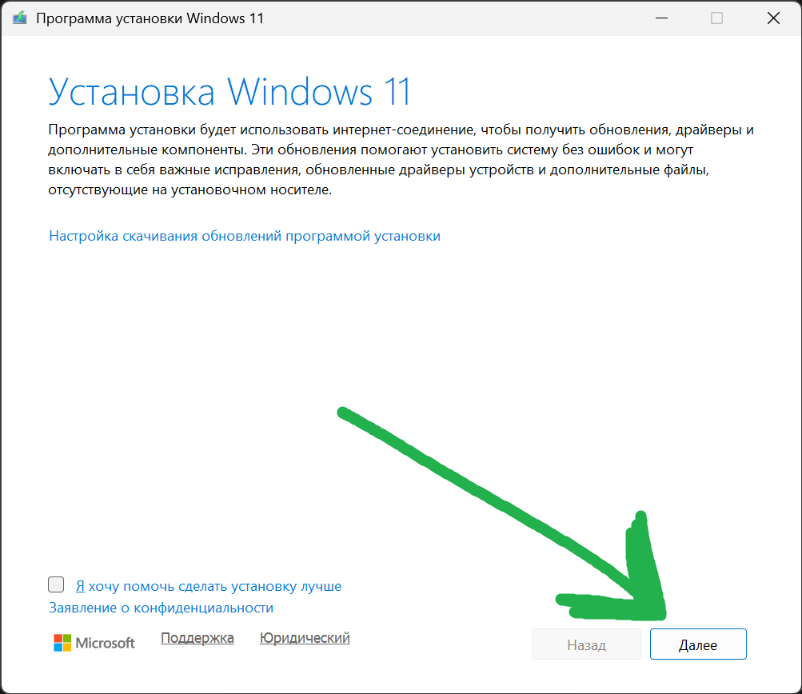

