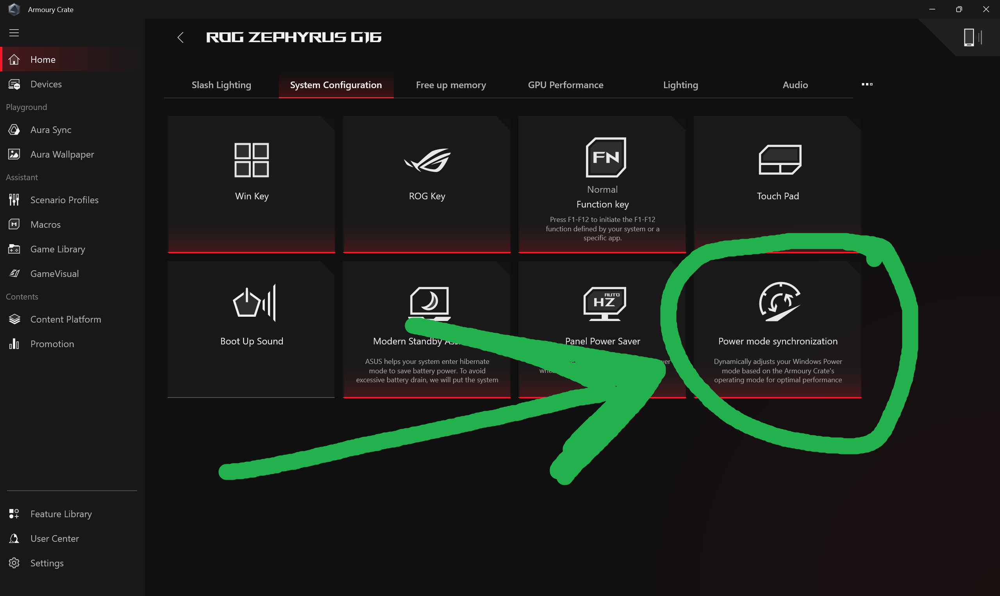

# TUF-ROG-Power-Plan-missing
If your power plan or Power mode synchronization ( option in Armoury crate) is missing on either TUF or ROG laptop you can watch this repository to possibly find a solution to bring them back.

# That's how usually it looks normally.

# And that's all options you must have in Armoury Crate usually

# How to fix it?
There are 2 ways. Depends on your conditions. I will separate them later.

## 1 Step
install **Armoury Crate uninstall tool**
 **Link:** https://www.asus.com/supportonly/armoury%20crate/helpdesk_download/
